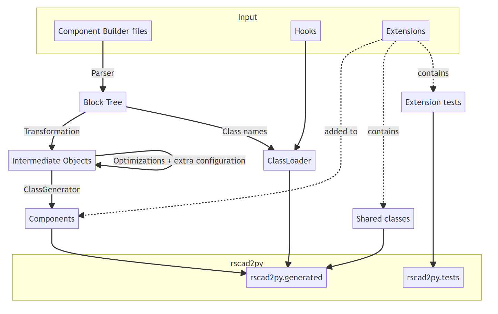

.. _class_extractor:

Class Extractor Usage
=====================

The *ClassExtractor* tool is a code generator for the classes representing the 
RSCAD components and dependent classes.
It is (almost) idempotent, so its output is reproducible over every supported platform.

.. attention:: The ClassExtractor needs to be run before the first use of pyapi_rts.

In addition, it should be used every time the RSCAD FX version changes or new user defined
components are added.

Requirements
------------
- Python >= 3.10
- RSCAD FX >= 1.0 installed **OR** the COMPONENTS folder from a RSCAD FX installation

Basic usage
-----------

1. Copy  the *RSCAD FX x.x/MLIB/COMPONENTS* directory 
(Windows: *C://Program Files/RTDS/RSCAD FX x.x/...*) to the
pyapi_rts/class_extractor/COMPONENTS directory.

**OR**

Use the --path option to specify the path to the RSCAD FX components directory.

2. Run the ClassExtractor tool: 
    >>> poetry run python ./pyapi_rts/class_extractor/main.py
    
    Options:

    - -h / --help: show the help message and exit
    - --delete / -d : delete any previously generated classes
    - --path / -p : specify the path to the RSCAD FX components directory
    - --includeobsolete / -i : include components in the OBSOLETE folder
    - --threads / -t : specify the number of threads to use (default: 8)

Files used by the ClassExtractor
--------------------------------

ComponentBuilder files directory
^^^^^^^^^^^^^^^^^^^^^^^^^^^^^^^^

The COMPONENTS folder from your RSCAD FX installation.

Extensions directory
^^^^^^^^^^^^^^^^^^^^

(see :ref:`Extensions <component_extensions>`) 
The directory to place the extensions (directories) in.

The requirements for those directories are defined on the :ref:`Extensions <component_extensions>` page.

Hooks directory 
^^^^^^^^^^^^^^^

(see :ref:`Hooks <hooks>`)
The directory to place the hooks (Python classes implementing :class:`~.ComponentHook`) in.

Component Tags (component_tags.txt)
^^^^^^^^^^^^^^^^^^^^^^^^^^^^^^^^^^^

A list of tags for components.
This can provide additional information for components that is not contained in the Component Builder file.

The format is a list of tags with the tag name and the components it applies to indented in the following lines, one component per line.

Currently supported tags are:

+-------------------------+---------------------------------------------------------+
| Tag                     | Description                                             |
+=========================+=========================================================+
|| `connecting`           || The component is used for connecting other components. |
||                        || Examples are wires, buses and similar components.      |
+-------------------------+---------------------------------------------------------+
|| `hierarchy_connecting` ||                                                        |
||                        ||                                                        |
+-------------------------+---------------------------------------------------------+
| `label`                 | The component can label a bus or other connection.      |
+-------------------------+---------------------------------------------------------+

Initial Enum Pool (enum_pool.txt) 
^^^^^^^^^^^^^^^^^^^^^^^^^^^^^^^^^

The initial Enum Pool used during component generation.
The enum pool is a set of enumerations with distinct options from each other.
By pre-defining some enums in this set, it is possible to assign certain names to common enums.
The enum values are case-sensitive.

.. code-block:: text

    ENUM
    <name> 
    <value1>
    <value2>
    ...
    END
    ...

ClassExtractor Structure
------------------------

Because all of the inputs are considered a part of the :code:`class_extractor` module and the :code:`pyapi_rts.generated` module is derived from it, the 'generated' module is used by the unit tests and generated as part of the testing pipeline.

The exception to this are Extensions, as their structure makes them likely to break after changes to the :code:`class_extractor` module.
Extensions are only includes in the component generation in a second run, after a run of the ClassExtractor without extensions resulted in passing tests.

Outputs
-------

Components
^^^^^^^^^^

Representations of the component types included in RSCAD FX.

Enums 
^^^^^

Enums used by parameters of RSCAD components, shared between components to save memory and storage.

class_loader.py
^^^^^^^^^^^^^^^

Includes a set of attributes and methods used to lazy-load the generated classes and execute the hooks.

1. :code:`get_by_key(key: str) -> Component`: Loads and caches the Component class and returns a new instance.
2. :code:`hooks() -> list[ComponentHook]`: Returns a list of all the hooks.
