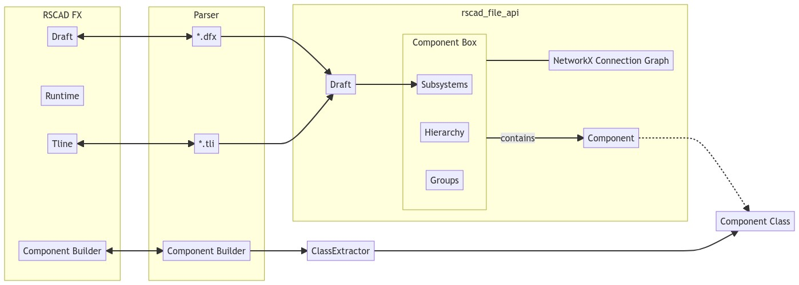
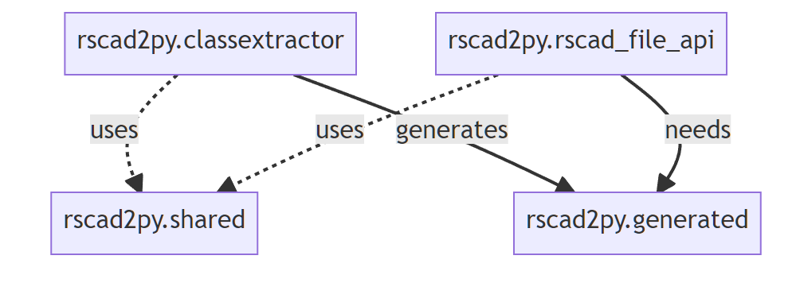

Overview
========

This page gives an overview of the structure of the project.

Structure
---------

Modules
-------

The project is divided into several modules.

The package meant to be used by the user is the ``pyapi_rts.api`` module.
It contains the classes and functions that are used to read and write RSCAD files and edit the models.

The ``pyapi_rts.class_extractor`` module contains everything needed to extract the classes from the Component Builder files and extensions and hooks.
It has no dependencies on the ``pyapi_rts.api`` module.
The module is used to store all of the data necessary to generate the classes from the Component Builder files.
It is not needed for the distribution of projects built using the API.
The results of the process are stored in the ``pyapi_rts.generated`` module.

The ``pyapi_rts.shared`` module contains the classes that are shared between the api and class_extractor modules.

Development
-----------

The development is strongly affected by the 'black box' of the RSCAD FX program.
This requires a lot of manual work figuring out the behavior of RSCAD and its included tools.

This problem becomes even more severe when the RSCAD FX program is updated or new features are added to pyapi_rts.
For that reason, the development of pyapi_rts heavily relies on testing and modularization into mostly self-contained modules and features that are easy to test.

Ideally, the tests are written first and checked in with the code.
Additionally, assumptions about the behavior of RSCAD FX should be documented and represented by a known good RSCAD model.